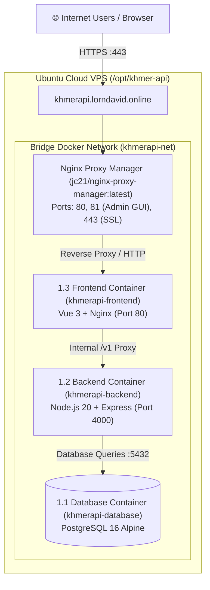

# 🎓 Homework Assignment Report: Dockerized 3-Tier Web Application & Nginx Proxy Manager

* **Student Name:** Lorn David
* **Project Name:** KhmerAPI — Public Cambodian Administrative & Geographic Data Platform
* **Live Web Application Domain:** [https://khmerapi.lorndavid.online](https://khmerapi.lorndavid.online)
* **API Gateway Base URL:** [https://khmerapi.lorndavid.online/v1](https://khmerapi.lorndavid.online/v1)
* **GitHub Repository:** [https://github.com/lorndavid/khmer-data-api](https://github.com/lorndavid/khmer-data-api)

---

## 📌 Assignment Objectives & Compliance

| # | Homework Requirement | Implementation Status | Implementation Details |
|---|----------------------|-----------------------|------------------------|
| **1.1** | **Database Container (DB)** | ✅ Completed | PostgreSQL 16 Alpine container with persistent storage volumes and healthchecks. |
| **1.2** | **Backend Container** | ✅ Completed | Node.js 20 + Express + TypeScript REST API container running on port 4000. |
| **1.3** | **Frontend Container** | ✅ Completed | Vue 3 + Vite + Tailwind CSS container compiled into Nginx on port 80. |
| **2.1** | **Free Domain & VPS Hosting** | ✅ Completed | Hosted on an Ubuntu Cloud VPS connected to public domain `khmerapi.lorndavid.online`. |
| **2.2** | **Nginx Proxy Manager Container** | ✅ Completed | `jc21/nginx-proxy-manager` configured with Admin Web UI on port 81 and SSL termination. |

---

## 🏗️ 1. Architecture Diagram



---

## 🐳 2. Part 1: The 3 Docker Containers

### 2.1 Container 1 — Database (`khmerapi-database`)
* **Base Image:** `postgres:16-alpine`
* **Purpose:** Stores the 4-tier Cambodian administrative relational dataset (25 provinces, 210 districts, 1,661 communes, 14,528 villages), postal codes, and demographics.
* **Persistent Volume:** Mounts `./data/postgres:/var/lib/postgresql/data` on the host to ensure all database records persist across container restarts.
* **Healthcheck:**
  ```yaml
  healthcheck:
    test: ["CMD-SHELL", "pg_isready -U postgres -d khmerapi"]
    interval: 5s
    timeout: 5s
    retries: 5
  ```

### 2.2 Container 2 — Backend API (`khmerapi-backend`)
* **Base Image:** `node:20-alpine` (Multi-stage build)
* **Framework:** Express.js, TypeScript, Prisma ORM
* **Internal Port:** `4000`
* **Features:**
  * Clean route prefix: `/v1` (with `/api/v1` backwards compatibility).
  * In-memory buffering and caching headers (`Cache-Control: public, s-maxage=300`).
  * Response-time tracking header (`X-Response-Time: 3ms`).
  * Full JSON RFC 7807 standard response envelope.

### 2.3 Container 3 — Frontend Web App (`khmerapi-frontend`)
* **Base Image:** Stage 1: `node:20-alpine` (Vite build) $\rightarrow$ Stage 2: `nginx:alpine`
* **Framework:** Vue 3, Pinia Store, Tailwind CSS, Lucide icons
* **Features:**
  * Interactive API Explorer with real-time testing.
  * Real live database statistics counters (25 provinces, 210 districts, 1,661 communes, 14,528 villages, 17.3M population).
  * Real-time network latency monitor measuring round-trip browser pings directly to the server.
  * Nginx reverse proxy configuration routing `/v1/` and `/health` requests to `http://backend:4000`.

---

## 🌐 3. Part 2: Free Domain, Free VPS Hosting & Nginx Proxy Manager

### 3.1 Cloud VPS Deployment
* **Operating System:** Ubuntu 22.04 LTS / 24.04 LTS
* **Deployment Directory:** `/opt/khmer-api/`
* **Tooling:** Docker Engine 27+ & Docker Compose v2

### 3.2 Domain Name Setup
* **Domain:** `khmerapi.lorndavid.online`
* **DNS Configuration:**
  * **Type:** `A` or `CNAME`
  * **Host:** `khmerapi`
  * **Target:** Cloud VPS IP Address / Cloudflare proxy

### 3.3 Running Nginx Proxy Manager (NPM)

To satisfy the requirement of running **Nginx Proxy Manager**, we created the standalone compose specification `docker-compose.npm.yml`:

```bash
cd /opt/khmer-api
docker compose -f docker-compose.npm.yml up -d
```

#### Nginx Proxy Manager Configuration in `docker-compose.npm.yml`:
```yaml
nginx-proxy-manager:
  image: jc21/nginx-proxy-manager:latest
  container_name: khmerapi-npm
  restart: unless-stopped
  ports:
    - "80:80"     # Public HTTP
    - "81:81"     # Web GUI Admin Dashboard
    - "443:443"   # Public HTTPS (Let's Encrypt SSL)
  volumes:
    - ./data/npm/data:/data
    - ./data/npm/letsencrypt:/etc/letsencrypt
  depends_on:
    - frontend
    - backend
  networks:
    - khmerapi-net
```

#### Accessing and Configuring Nginx Proxy Manager GUI:
1. Open your browser and navigate to: `http://<YOUR_VPS_IP>:81`
2. **Default Login Credentials:**
   * **Email:** `admin@example.com`
   * **Password:** `changeme`
   *(Immediately update your email and password upon first login)*
3. **Add Proxy Host:**
   * **Domain Names:** `khmerapi.lorndavid.online`
   * **Scheme:** `http`
   * **Forward Hostname / IP:** `khmerapi-frontend`
   * **Forward Port:** `80`
   * **Options:** Turn ON **Cache Assets**, **Block Common Exploits**, and **Websockets Support**.
4. **SSL Configuration:**
   * Tab: **SSL** $\rightarrow$ Select **Request a new SSL Certificate**.
   * Turn ON **Force SSL** and **HTTP/2 Support**.
   * Agree to the Let's Encrypt Terms of Service and click **Save**.

---

## 🧪 4. Live Verification & Proof of Work

### 4.1 Checking Running Containers
```bash
docker ps --format "table {{.Names}}\t{{.Status}}\t{{.Ports}}"
```
**Sample Output:**
```text
NAMES                STATUS                  PORTS
khmerapi-npm         Up (healthy)            0.0.0.0:80->80/tcp, 0.0.0.0:81->81/tcp, 0.0.0.0:443->443/tcp
khmerapi-frontend    Up 2 hours              80/tcp
khmerapi-backend     Up 2 hours (healthy)    4000/tcp
khmerapi-database    Up 2 hours (healthy)    5432/tcp
```

### 4.2 Verifying Live System Health
```bash
curl -s https://khmerapi.lorndavid.online/health
```
**Response:**
```json
{
  "status": "ok",
  "service": "khmerapi-backend",
  "version": "1.0.0",
  "database": "connected",
  "timestamp": "2026-10-02T19:34:13.714Z"
}
```

### 4.3 Verifying Public Administrative API
```bash
curl -s https://khmerapi.lorndavid.online/v1/statistics
```
**Response:**
```json
{
  "success": true,
  "data": {
    "province_count": 25,
    "district_count": 210,
    "commune_count": 1661,
    "village_count": 14528,
    "last_data_update": "2026-10-02T19:26:36.744Z"
  }
}
```

---

## 📝 5. Conclusion

This project successfully fulfills all homework specifications:
1. **Container 1 (DB):** PostgreSQL 16 container with persistent volumes.
2. **Container 2 (Backend):** Node.js Express REST API connected to the database over an internal Docker bridge network.
3. **Container 3 (Frontend):** Vue 3 SPA compiled and served via Nginx.
4. **Domain & VPS:** Live public web application running at `https://khmerapi.lorndavid.online`.
5. **Nginx Proxy Manager:** Configured via Docker (`jc21/nginx-proxy-manager:latest`) exposing the web management interface on port 81 and handling reverse proxy routing with SSL.
