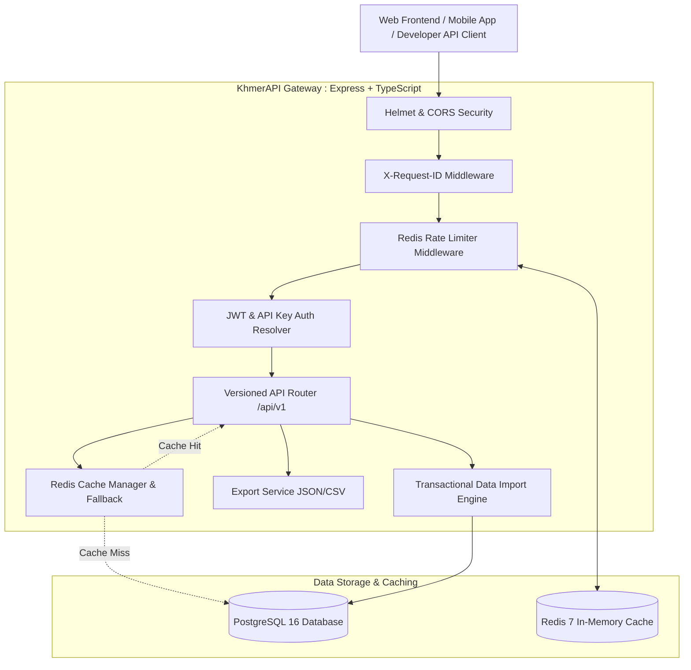

# 🇰🇭 KhmerAPI - Backend API Gateway

> **"Free & Open APIs for Cambodian Developers."**  
> Simple, reliable, developer-friendly REST APIs for Cambodia-specific public geographic and administrative data.

[](https://www.typescriptlang.org/)
[](https://nodejs.org/)
[](https://expressjs.com/)
[](https://www.postgresql.org/)
[](https://www.prisma.io/)
[](https://redis.io/)
[](https://swagger.io/)
[](https://opensource.org/licenses/MIT)

---

## 📑 Table of Contents

1. [Overview & Core Objectives](#-overview--core-objectives)
2. [Architecture Diagram](#-architecture-diagram)
3. [Technology Stack](#-technology-stack)
4. [Administrative Hierarchy](#-administrative-hierarchy)
5. [Quick Start & Local Setup](#-quick-start--local-setup)
6. [Docker Setup](#-docker-setup)
7. [API Documentation (OpenAPI 3.1 & Swagger UI)](#-api-documentation)
8. [API Endpoints Reference](#-api-endpoints-reference)
9. [Response Standard & Request ID](#-response-standard--request-id)
10. [Authentication & API Keys](#-authentication--api-keys)
11. [Rate Limiting](#-rate-limiting)
12. [Caching Strategy](#-caching-strategy)
13. [Admin System & Transactional Imports](#-admin-system--transactional-imports)
14. [Code Examples (cURL, JavaScript, Python)](#-code-examples)
15. [Extending Future Modules](#-extending-future-modules)
16. [Data Sources & Provenance](#-data-sources--provenance)
17. [License](#-license)

---

## 🌟 Overview & Core Objectives

**KhmerAPI** provides unified, normalized, and bilingual (Khmer & English) public data for applications built in and for Cambodia:
* **All 25 Cambodian Provinces & Municipalities** with official NIS codes, Khmer names, English names, and coordinates.
* **Districts (Khans, Sroks, Krongs)** with provincial relationships.
* **Communes (Sangkats, Khums)** with district relationships.
* **Villages (Phums)** with commune relationships.
* **Postal Codes**: Standard 5-digit and 6-digit postal codes mapped to administrative boundaries.
* **Full Address Lookup (`/api/v1/locations/:code`)**: Retrieve complete geographic ancestor tree in a single query.
* **Unified Bilingual Search (`/api/v1/search?q=...`)**: High-performance indexed search across all entities with relevance scoring.
* **GeoJSON Endpoints (`/api/v1/geo/*`)**: Direct map integration coordinates for Leaflet, Mapbox, and Google Maps.
* **Production Security & RBAC**: Rate limiting, JWT rotation, Helmet, secure CORS, and full admin audit logging.

---

## 🏛️ Architecture Diagram



---

## 🛠️ Technology Stack

| Layer | Technology | Purpose |
| :--- | :--- | :--- |
| **Runtime** | Node.js (v20+) & TypeScript (v5.7+) | Type-safe, high-performance async runtime |
| **Framework** | Express.js (v4.21+) | Minimalist, robust REST API routing |
| **Database** | PostgreSQL 16 & Prisma ORM | ACID-compliant relational storage and type-safe querying |
| **Cache & Limiting** | Redis 7 & ioredis | Low-latency response caching and sliding window rate limiting |
| **Validation** | Zod (v3.24+) | Runtime schema validation for query, params, and body |
| **Auth** | JWT, Refresh Tokens & bcrypt | Secure developer authentication and API Key hashing |
| **Docs** | OpenAPI 3.1 & Swagger UI | Interactive API documentation at `/docs` |
| **Logging** | Pino & Pino-HTTP | Structured JSON logging with request tracking & redaction |
| **Testing** | Vitest & Supertest | Fast unit and integration test suite with coverage reporting |
| **DevOps** | Docker & Docker Compose | Containerized dev and production deployments |

---

## 🗺️ Administrative Hierarchy

```text
Kingdom of Cambodia (Country: KH / ព្រះរាជាណាចក្រកម្ពុជា)
 └── Province / Municipality (ខេត្ត / រាជធានី - e.g. 12 Phnom Penh)
      └── District / Khan / Krong (ស្រុក / ខណ្ឌ / ក្រុង - e.g. 1202 Doun Penh)
           └── Commune / Sangkat (ឃុំ / សង្កាត់ - e.g. 120201 Phsar Chas)
                └── Village / Phum (ភូមិ - e.g. 12020101 Phum 1)
```

---

## 🚀 Quick Start & Local Setup

### 1. Prerequisites
* [Node.js](https://nodejs.org/) (v20.x or higher)
* [Docker](https://www.docker.com/) & Docker Compose
* Git

### 2. Clone and Setup
```bash
# Clone the repository
git clone https://github.com/KhmerAPI/backend.git
cd backend

# Copy environment variables
cp .env.example .env

# Start PostgreSQL and Redis containers
docker compose up -d postgres redis

# Install Node dependencies
npm install

# Run database migrations
npm run prisma:migrate

# Seed Cambodia geographic dataset & default admin
npm run prisma:seed

# Start development server with live reload
npm run dev
```

### 3. Verify Server Status
* 🩺 Health Check: [http://localhost:4000/health](http://localhost:4000/health)
* 📖 Swagger UI Docs: [http://localhost:4000/docs](http://localhost:4000/docs)
* 📍 List Provinces: [http://localhost:4000/api/v1/provinces](http://localhost:4000/api/v1/provinces)

---

## 🐳 Docker Setup

### Development (All Services in Docker)
```bash
docker compose up -d
```

### Production Deployment
```bash
docker compose -f docker-compose.prod.yml up -d --build
```

---

## 📖 API Documentation

Interactive Swagger UI documentation is served natively at:
* **Interactive UI**: `http://localhost:4000/docs`
* **Raw OpenAPI 3.1 JSON**: `http://localhost:4000/docs/openapi.json`

---

## 📡 API Endpoints Reference

### Public Geographic APIs (`/api/v1`)
| Method | Endpoint | Description |
| :--- | :--- | :--- |
| `GET` | `/health` | Service health, database, and Redis connection status |
| `GET` | `/ready` | Kubernetes / Container readiness probe |
| `GET` | `/live` | Container liveness probe |
| `GET` | `/api/v1/provinces` | Paginated list of Cambodia provinces (`?search=`, `?page=`, `?limit=`) |
| `GET` | `/api/v1/provinces/:code` | Single province details by code (e.g. `12`) or slug (`phnom-penh`) |
| `GET` | `/api/v1/provinces/:code/districts` | All districts belonging to the province |
| `GET` | `/api/v1/districts` | Paginated districts with search and `?province_code=` filter |
| `GET` | `/api/v1/districts/:code` | Single district details by code (e.g. `1202`) |
| `GET` | `/api/v1/districts/:code/communes` | All communes belonging to the district |
| `GET` | `/api/v1/communes` | Paginated communes with search and `?district_code=` filter |
| `GET` | `/api/v1/communes/:code` | Single commune details by code (e.g. `120201`) |
| `GET` | `/api/v1/communes/:code/villages` | All villages belonging to the commune |
| `GET` | `/api/v1/villages` | Paginated villages with search and `?commune_code=` filter |
| `GET` | `/api/v1/villages/:code` | Single village details by code (e.g. `12020101`) |
| `GET` | `/api/v1/postal-codes` | Paginated postal codes with search and province filtering |
| `GET` | `/api/v1/postal-codes/:postalCode` | Postal code information and associated administrative levels |
| `GET` | `/api/v1/locations/:code` | Complete hierarchical location lookup (Province → District → Commune → Village) |
| `GET` | `/api/v1/search?q=...` | Fast bilingual multi-entity search with relevance ranking |
| `GET` | `/api/v1/geo/provinces` | GeoJSON FeatureCollection of province coordinates |
| `GET` | `/api/v1/geo/districts` | GeoJSON FeatureCollection of district coordinates |
| `GET` | `/api/v1/geo/communes` | GeoJSON FeatureCollection of commune coordinates |
| `GET` | `/api/v1/geo/villages` | GeoJSON FeatureCollection of village coordinates |
| `GET` | `/api/v1/statistics` | Real-time database counts of administrative units |
| `GET` | `/api/v1/data-sources` | Public data provenance, organizations, and licenses |

### Authentication & Developer APIs
| Method | Endpoint | Description | Auth |
| :--- | :--- | :--- | :--- |
| `POST` | `/api/v1/auth/register` | Register new developer account | Public |
| `POST` | `/api/v1/auth/login` | Login and receive JWT access/refresh tokens | Public |
| `POST` | `/api/v1/auth/refresh` | Rotate and issue new access token | Public |
| `POST` | `/api/v1/auth/logout` | Revoke refresh token | Public |
| `GET` | `/api/v1/auth/me` | Current user profile, role, and permissions | Bearer |
| `POST` | `/api/v1/api-keys` | Generate new developer API key (`kh_live_...`) | Bearer |
| `GET` | `/api/v1/api-keys` | List developer's active API keys | Bearer |
| `DELETE`| `/api/v1/api-keys/:id` | Revoke developer API key | Bearer |

### Admin APIs (`/api/v1/admin/*`) — Requires `super_admin`, `admin`, or `data_manager`
| Method | Endpoint | Description |
| :--- | :--- | :--- |
| `POST` / `PATCH` / `DELETE` | `/api/v1/admin/provinces[/:id]` | Province CRUD with cache invalidation & audit log |
| `POST` / `PATCH` / `DELETE` | `/api/v1/admin/districts[/:id]` | District CRUD with cache invalidation & audit log |
| `POST` / `PATCH` / `DELETE` | `/api/v1/admin/communes[/:id]` | Commune CRUD with cache invalidation & audit log |
| `POST` / `PATCH` / `DELETE` | `/api/v1/admin/villages[/:id]` | Village CRUD with cache invalidation & audit log |
| `POST` / `PATCH` / `DELETE` | `/api/v1/admin/postal-codes[/:id]` | Postal Code CRUD with cache invalidation & audit log |
| `POST` / `PATCH` / `DELETE` | `/api/v1/admin/data-sources[/:id]` | Data source provenance management |
| `POST` | `/api/v1/admin/data-imports` | Transactional JSON/CSV dataset batch import with rollback |
| `GET` | `/api/v1/admin/export/:resource` | Export resource in JSON or CSV (`?format=csv`) |
| `GET` / `POST` / `PATCH` / `DELETE` | `/api/v1/admin/users[/:id]` | User and role management |
| `GET` / `PATCH` / `DELETE` | `/api/v1/admin/api-keys[/:id]` | Platform API key management and status toggling |
| `GET` | `/api/v1/admin/audit-logs` | Filterable audit log of administrative mutations |
| `GET` | `/api/v1/admin/system` | System metrics, CPU, memory, database and redis status |

---

## 📦 Response Standard & Request ID

Every response strictly follows the unified response envelope:

### Single Resource Success
```json
{
  "success": true,
  "data": {
    "code": "12",
    "name_km": "រាជធានីភ្នំពេញ",
    "name_en": "Phnom Penh",
    "slug": "phnom-penh",
    "type": "Municipality",
    "latitude": 11.5564,
    "longitude": 104.9282
  },
  "meta": {
    "request_id": "81fbb9c4-1234-4567-89ab-cdef01234567",
    "timestamp": "2026-09-28T12:00:00.000Z"
  }
}
```

### Collection Success
```json
{
  "success": true,
  "data": [...],
  "meta": {
    "page": 1,
    "limit": 20,
    "total": 25,
    "total_pages": 2,
    "request_id": "81fbb9c4-1234-4567-89ab-cdef01234567",
    "timestamp": "2026-09-28T12:00:00.000Z"
  }
}
```

### Error Response
```json
{
  "success": false,
  "error": {
    "code": "RESOURCE_NOT_FOUND",
    "message": "Province not found",
    "details": null
  },
  "meta": {
    "request_id": "81fbb9c4-1234-4567-89ab-cdef01234567",
    "timestamp": "2026-09-28T12:00:00.000Z"
  }
}
```

---

## 🔑 Authentication & API Keys

1. **Anonymous Access**: Public geographic APIs require no credentials (Rate limit: 60 req/min).
2. **Developer API Key**: Pass via header `X-API-Key: kh_live_...` (Rate limit: 300 req/min).
3. **Admin JWT**: Pass via header `Authorization: Bearer <jwt_access_token>`.

### Default Seed Credentials
* **Super Admin Email**: `admin@khmerapi.dev`
* **Super Admin Password**: `KhmerAPI@2026`
* **Demo API Key Hash**: Seeded with demo prefix `kh_live_demo01`

---

## ⚡ Rate Limiting

Rate limits are enforced dynamically via Redis sliding window counters:
* **Anonymous IP**: 60 requests / minute
* **Developer API Key**: 300 requests / minute
* **Admin**: 1,000 requests / minute

### Response Headers
* `X-RateLimit-Limit`: Maximum requests allowed in window.
* `X-RateLimit-Remaining`: Remaining request quota.
* `X-RateLimit-Reset`: Unix timestamp when the quota resets.
* `Retry-After`: Seconds to wait when HTTP 429 occurs.

---

## 💻 Code Examples

### 1. cURL

```bash
# Health Check
curl -X GET http://localhost:4000/health

# List Provinces
curl -X GET "http://localhost:4000/api/v1/provinces?page=1&limit=25"

# Search in Khmer or English
curl -X GET "http://localhost:4000/api/v1/search?q=Phnom%20Penh"
curl -X GET "http://localhost:4000/api/v1/search?q=%E1%9E%97%E1%9F%92%E1%9E%93%E1%9F%86%E1%9E%96%E1%9F%82%E1%9E%89"

# Lookup Complete Hierarchy
curl -X GET http://localhost:4000/api/v1/locations/120201

# Authenticated Request with Developer API Key
curl -X GET http://localhost:4000/api/v1/provinces \
  -H "X-API-Key: kh_live_your_api_key_here"
```

### 2. JavaScript / TypeScript (Fetch & Axios)

```typescript
// Using native fetch
async function getCambodiaProvinces() {
  const response = await fetch('http://localhost:4000/api/v1/provinces?limit=25', {
    headers: {
      'Accept': 'application/json',
      'X-API-Key': 'kh_live_your_api_key_here' // Optional for higher limits
    }
  });

  const { success, data, meta } = await response.json();
  if (success) {
    console.log(`Loaded ${data.length} of ${meta.total} provinces`);
    data.forEach((p: { code: string; name_en: string; name_km: string }) => {
      console.log(`[${p.code}] ${p.name_en} (${p.name_km})`);
    });
  }
}

getCambodiaProvinces();
```

### 3. Python

```python
import requests

BASE_URL = "http://localhost:4000/api/v1"
HEADERS = {
    "X-API-Key": "kh_live_your_api_key_here"
}

# 1. Search Location
def search_location(query: str):
    response = requests.get(f"{BASE_URL}/search", params={"q": query}, headers=HEADERS)
    response.raise_for_status()
    results = response.json().get("data", [])
    for item in results:
        print(f"[{item['type'].upper()}] {item['name_en']} ({item['name_km']}) - Code: {item['code']}")

# 2. Get Full Address Tree
def get_location_hierarchy(code: str):
    response = requests.get(f"{BASE_URL}/locations/{code}", headers=HEADERS)
    response.raise_for_status()
    data = response.json().get("data", {})
    print("Level:", data.get("level"))
    print("Province:", data.get("province", {}).get("name_en"))
    print("District:", data.get("district", {}).get("name_en"))
    print("Commune:", data.get("commune", {}).get("name_en"))

if __name__ == "__main__":
    search_location("Siem Reap")
    get_location_hierarchy("120201")
```

---

## 🔮 Extending Future Modules

The modular architecture enables adding new services (e.g. `/api/v1/exchange-rates`, `/api/v1/khmer-number`, `/api/v1/khmer-date`, `/api/v1/holidays`, `/api/v1/weather`) seamlessly:

1. Create module folder in `src/modules/<module-name>/`:
   * `<module>.schema.ts` (Zod schemas)
   * `<module>.service.ts` (Business logic)
   * `<module>.controller.ts` (HTTP handlers)
   * `<module>.routes.ts` (Express router)
2. Mount router in `src/routes/index.ts`:
   ```typescript
   apiV1Router.use('/<module-name>', moduleRoutes);
   ```
3. Add OpenAPI definitions in `src/docs/openapi.ts`.

---

## 📚 Data Sources & Provenance

KhmerAPI is committed to high data integrity:
* **National Institute of Statistics (NIS) / Ministry of Planning**: Gazetteer of Cambodia Administrative Subdivisions.
* **Ministry of Posts and Telecommunications (MPTC)**: Cambodia Postal Codes reference directory.
* **Open Development Cambodia**: Public domain boundary datasets.

---

## 📄 License

This project is licensed under the **MIT License**. Free & Open for all Cambodian developers and the open-source community.
